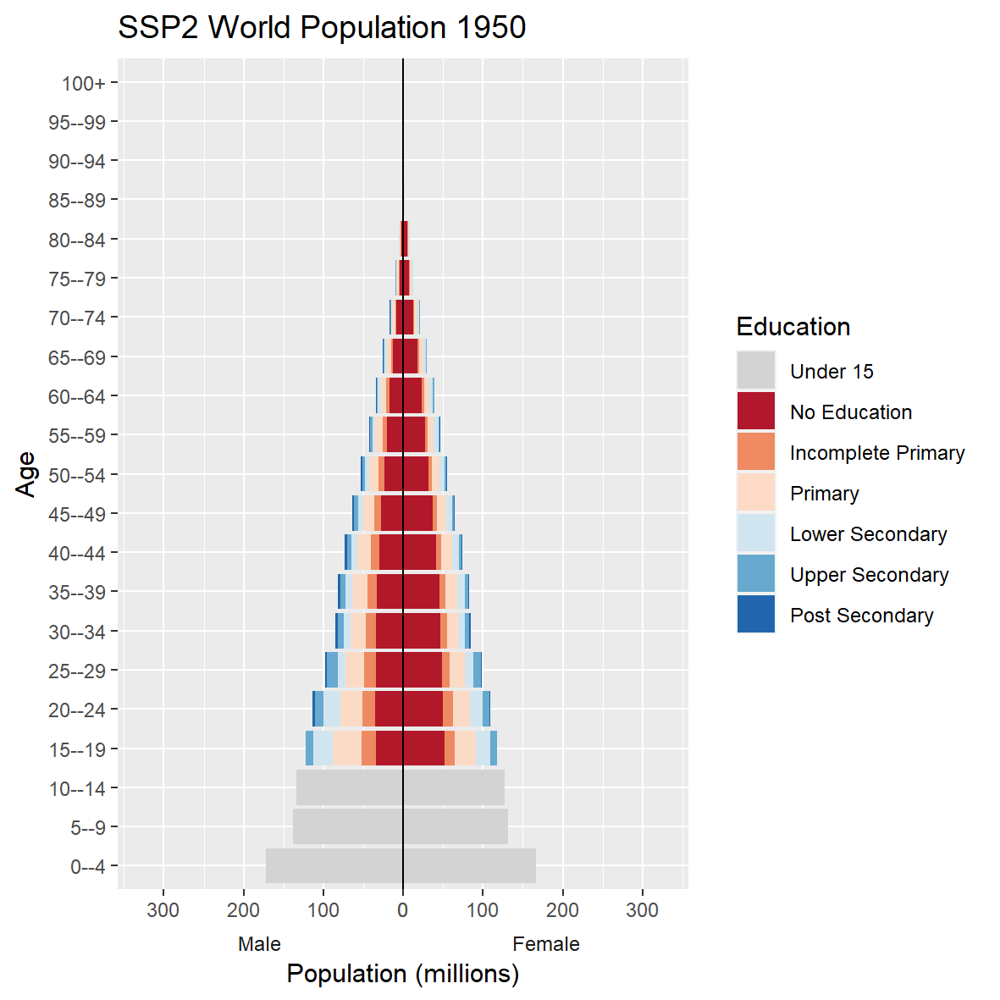

<!-- README.md is generated from README.Rmd. Please edit that file -->

```{r, include = FALSE}
knitr::opts_chunk$set(
  collapse = TRUE,
  comment = "#>",
  fig.path = "man/figures/README-",
  out.width = "100%"
)
```

# wcde

<!-- badges: start -->
[](https://CRAN.R-project.org/package=wcde)
[](https://r-pkg.org/pkg/wcde)
[](https://www.tidyverse.org/lifecycle/#experimental)
[](https://github.com/guyabel/wcde/actions)
<!-- badges: end -->


Download data from the [Wittgenstein Centre Human Capital Data Explorer](http://dataexplorer.wittgensteincentre.org/wcde-v2/) into R

See the [pkgdown site](https://guyabel.github.io/wcde/) for full details.

## Installation

You can install the released version of `wcde` from [CRAN](https://CRAN.R-project.org) with:

```{r eval=FALSE}
install.packages("wcde")
```

Install the developmental version with:

```{r eval=FALSE}
library(devtools)
install_github("guyabel/wcde", ref = "main")
```

## Example

Download data based on a indicator, scenario and country code:

```{r example}
library(wcde)

# SSP2 education specific tfr for Austria
get_wcde(indicator = "etfr", country_name = "Austria")

# SSP2 education specific population sizes for Iran and Kenya
get_wcde(indicator = "epop", country_code = c(364, 404))

# SSP1, 2 and 3 gender gaps in educational attainment (15+) for all countries
get_wcde(indicator = "ggapedu15", scenario = 1:3)
```

## Vignette

The [vignette](https://guyabel.github.io/wcde/articles/wcde.html) provides many more examples on how to use the package to download data and produce plots from the Wittgenstein Centre Human Capital Data Explorer.

```{r, echo=FALSE, eval=FALSE}
# run by hand
library(gganimate)

d <- get_wcde(indicator = "epop", country_code = 900) 

g <- d %>%
  edu_group_sum(n = 6) %>%
  mutate(pop = ifelse(test = sex == "Male", yes = -epop, no = epop),
         pop = pop/1e3,
         pop_max = ifelse(sex == "Male", -max(pop), max(pop))) %>%
  ggplot(mapping = aes(x = pop, y = age, fill = fct_rev(education))) +
  geom_col() +
  geom_vline(xintercept = 0, colour = "black") +
  scale_x_continuous(labels = abs, expand = c(0, 0)) +
  scale_fill_manual(values = wic_col6, name = "Education") +
  facet_wrap(facets = "sex", scales = "free_x", strip.position = "bottom") +
  geom_blank(mapping = aes(x = pop_max * 1.1)) +
  theme(panel.spacing.x = unit(0, "pt"),
        strip.placement = "outside",
        strip.background = element_rect(fill = "transparent"),
        strip.text.x = element_text(margin = margin( b = 0, t = 0))) +
  transition_time(time = year) +
  labs(x = "Population (millions)", y = "Age", 
       title = 'SSP2 World Population {round(frame_time)}')

animate(g, width = 15, height = 15, units = "cm", res = 200, 
        renderer = gifski_renderer())

anim_save(filename = "world6_ssp2.gif")
```


<!--  -->


