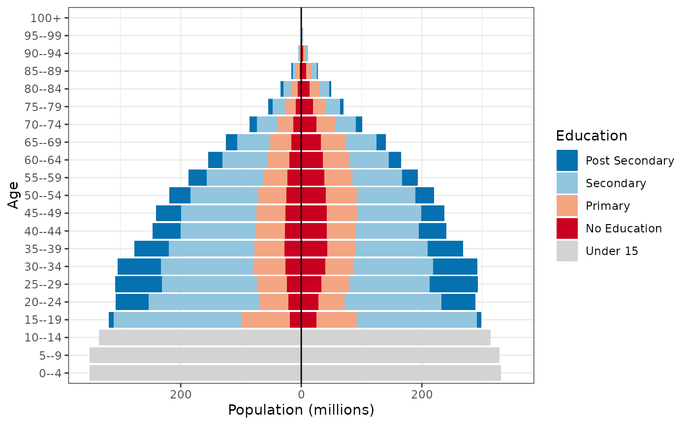
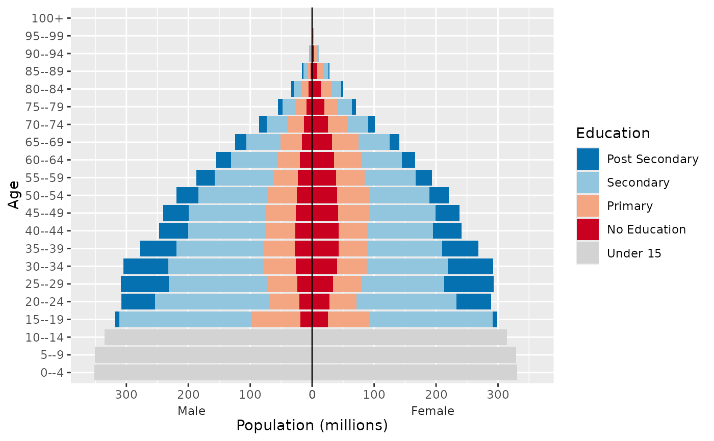
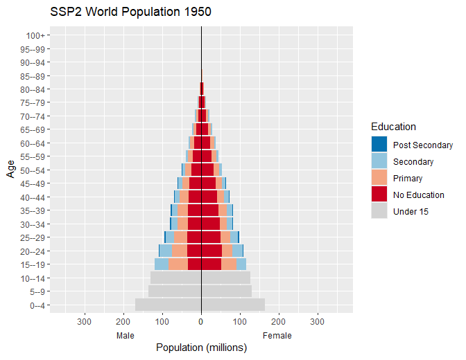

# Overview of the wcde package

The `wcde` package allows for R users to easily download data from the
[Wittgenstein Centre for Demography and Human Capital Data
Explorer](https://dataexplorer.wittgensteincentre.org/) as well as
containing a number of helpful functions for working with education
specific demographic data.

## Installation

You can install the released version of `wcde` from
[CRAN](https://CRAN.R-project.org) with:

``` r

install.packages("wcde")
```

Install the developmental version with:

``` r

library(devtools)
install_github("guyabel/wcde", ref = "main")
```

## Getting data into R

The [`get_wcde()`](https://guyabel.github.io/wcde/reference/get_wcde.md)
function can be used to download data from the Wittgenstein Centre Human
Capital Data Explorer. It requires three user inputs

- `indicator`: a short code for the indicator of interest
- `scenario`: a number referring to a SSP narrative, by default 2 is
  used (for SSP2)
- `country_code` (or `country_name`): corresponding to the country of
  interest

``` r

library(wcde)
# download education specific tfr data
get_wcde(indicator = "etfr",
         country_name = c("Brazil", "Albania"))
#> # A tibble: 192 × 6
#>    scenario name    country_code education          period     etfr
#>       <dbl> <chr>          <dbl> <chr>              <chr>     <dbl>
#>  1        2 Brazil            76 No Education       2020-2025  2.24
#>  2        2 Albania            8 No Education       2020-2025  2.31
#>  3        2 Brazil            76 Incomplete Primary 2020-2025  2.24
#>  4        2 Albania            8 Incomplete Primary 2020-2025  2.51
#>  5        2 Brazil            76 Primary            2020-2025  2.24
#>  6        2 Albania            8 Primary            2020-2025  2.17
#>  7        2 Brazil            76 Lower Secondary    2020-2025  1.78
#>  8        2 Albania            8 Lower Secondary    2020-2025  1.88
#>  9        2 Brazil            76 Upper Secondary    2020-2025  1.35
#> 10        2 Albania            8 Upper Secondary    2020-2025  1.61
#> # ℹ 182 more rows

# download education specific survivorship rates
get_wcde(indicator = "eassr",
         country_name = c("Niger", "Korea"))
#> # A tibble: 8,448 × 8
#>    scenario name              country_code age    sex   education   period eassr
#>       <dbl> <chr>                    <dbl> <chr>  <chr> <chr>       <chr>  <dbl>
#>  1        2 Niger                      562 15--19 Male  No Educati… 2020-… 0.986
#>  2        2 Republic of Korea          410 15--19 Male  No Educati… 2020-… 0.999
#>  3        2 Niger                      562 15--19 Male  Incomplete… 2020-… 0.988
#>  4        2 Republic of Korea          410 15--19 Male  Incomplete… 2020-… 0.999
#>  5        2 Niger                      562 15--19 Male  Primary     2020-… 0.989
#>  6        2 Republic of Korea          410 15--19 Male  Primary     2020-… 0.999
#>  7        2 Niger                      562 15--19 Male  Lower Seco… 2020-… 0.992
#>  8        2 Republic of Korea          410 15--19 Male  Lower Seco… 2020-… 0.999
#>  9        2 Niger                      562 15--19 Male  Upper Seco… 2020-… 0.992
#> 10        2 Republic of Korea          410 15--19 Male  Upper Seco… 2020-… 0.999
#> # ℹ 8,438 more rows
```

### Indicator codes

The indicator input must match the short code from the indicator table.
The
[`find_indicator()`](https://guyabel.github.io/wcde/reference/find_indicator.md)
function can be used to look up short codes (given in the first column)
from the `wic_indicators` data frame:

``` r

find_indicator(x = "tfr")
#> # A tibble: 2 × 6
#>   indicator description          `wcde-v3` `wcde-v2` `wcde-v1` definition_latest
#>   <chr>     <chr>                <chr>     <chr>     <chr>     <chr>            
#> 1 etfr      Total Fertility Rat… projecti… projecti… projecti… The average numb…
#> 2 tfr       Total Fertility Rate past-ava… past-ava… past-ava… The average numb…
```

### Temporal coverage

By default, `get_wdce()` returns data for all years or available periods
or years. The
[`filter()`](https://dplyr.tidyverse.org/reference/filter.html) function
in [dplyr](https://cran.r-project.org/package=dplyr/index.html) can be
used to filter data for specific years or periods, for example:

``` r

library(tidyverse)
get_wcde(indicator = "e0",
         country_name = c("Japan", "Australia")) %>%
  filter(period == "2015-2020")
#> # A tibble: 4 × 6
#>   scenario name      country_code sex    period       e0
#>      <dbl> <chr>            <dbl> <chr>  <chr>     <dbl>
#> 1        2 Japan              392 Male   2015-2020  81.1
#> 2        2 Australia           36 Male   2015-2020  81.1
#> 3        2 Japan              392 Female 2015-2020  87.3
#> 4        2 Australia           36 Female 2015-2020  85.1

get_wcde(indicator = "sexratio",
         country_name = c("China", "South Korea")) %>%
  filter(year == 2020)
#> # A tibble: 44 × 6
#>    scenario name              country_code age     year sexratio
#>       <dbl> <chr>                    <dbl> <chr>  <dbl>    <dbl>
#>  1        2 China                      156 All     2020     1.05
#>  2        2 Republic of Korea          410 All     2020     1   
#>  3        2 China                      156 0--4    2020     1.14
#>  4        2 Republic of Korea          410 0--4    2020     1.05
#>  5        2 China                      156 5--9    2020     1.16
#>  6        2 Republic of Korea          410 5--9    2020     1.05
#>  7        2 China                      156 10--14  2020     1.17
#>  8        2 Republic of Korea          410 10--14  2020     1.07
#>  9        2 China                      156 15--19  2020     1.17
#> 10        2 Republic of Korea          410 15--19  2020     1.08
#> # ℹ 34 more rows
```

Past data is only available for selected indicators. These can be viewed
using the version column:

``` r

wic_indicators %>%
  filter(`wcde-v3` == "past-available") %>%
  select(1:2)
#> # A tibble: 28 × 2
#>    indicator description                                     
#>    <chr>     <chr>                                           
#>  1 asfr      Age-Specific Fertility Rate                     
#>  2 assr      Age-Specific Survival Ratio                     
#>  3 bmys      Mean Years of Schooling by Broad Age            
#>  4 bpop      Population Size by Broad Age (000's)            
#>  5 bprop     Educational Attainment Distribution by Broad Age
#>  6 cbr       Crude Birth Rate                                
#>  7 cdr       Crude Death Rate                                
#>  8 e0        Life Expectancy at Birth                        
#>  9 epop      Population Size by Education (000's)            
#> 10 ggapedu15 Gender Gap in Educational Attainment (15+)      
#> # ℹ 18 more rows
```

The [`filter()`](https://dplyr.tidyverse.org/reference/filter.html)
function can also be used to filter specific indicators to specific age,
sex or education groups

``` r

get_wcde(indicator = "sexratio",
         country_name = c("China", "South Korea")) %>%
  filter(year == 2020,
         age == "All")
#> # A tibble: 2 × 6
#>   scenario name              country_code age    year sexratio
#>      <dbl> <chr>                    <dbl> <chr> <dbl>    <dbl>
#> 1        2 China                      156 All    2020     1.05
#> 2        2 Republic of Korea          410 All    2020     1
```

### Country names and codes

Country names are guessed using the
[countrycode](https://cran.r-project.org/package=countrycode/index.html)
package.

``` r

get_wcde(indicator = "tfr",
         country_name = c("U.A.E", "Espania", "Österreich"))
#> # A tibble: 90 × 5
#>    scenario name                 country_code period      tfr
#>       <dbl> <chr>                       <dbl> <chr>     <dbl>
#>  1        2 United Arab Emirates          784 1950-1955  6.88
#>  2        2 Spain                         724 1950-1955  2.49
#>  3        2 Austria                        40 1950-1955  2.08
#>  4        2 United Arab Emirates          784 1955-1960  6.81
#>  5        2 Spain                         724 1955-1960  2.65
#>  6        2 Austria                        40 1955-1960  2.52
#>  7        2 United Arab Emirates          784 1960-1965  6.65
#>  8        2 Spain                         724 1960-1965  2.82
#>  9        2 Austria                        40 1960-1965  2.78
#> 10        2 United Arab Emirates          784 1965-1970  6.50
#> # ℹ 80 more rows
```

The [`get_wcde()`](https://guyabel.github.io/wcde/reference/get_wcde.md)
functions accepts ISO alpha numeric codes for countries via the
`country_code` argument:

``` r

get_wcde(indicator = "etfr", country_code = c(44, 100))
#> # A tibble: 192 × 6
#>    scenario name     country_code education          period     etfr
#>       <dbl> <chr>           <dbl> <chr>              <chr>     <dbl>
#>  1        2 Bahamas            44 No Education       2020-2025  2.2 
#>  2        2 Bulgaria          100 No Education       2020-2025  1.86
#>  3        2 Bahamas            44 Incomplete Primary 2020-2025  2.2 
#>  4        2 Bulgaria          100 Incomplete Primary 2020-2025  1.86
#>  5        2 Bahamas            44 Primary            2020-2025  2.2 
#>  6        2 Bulgaria          100 Primary            2020-2025  1.86
#>  7        2 Bahamas            44 Lower Secondary    2020-2025  1.74
#>  8        2 Bulgaria          100 Lower Secondary    2020-2025  1.86
#>  9        2 Bahamas            44 Upper Secondary    2020-2025  1.46
#> 10        2 Bulgaria          100 Upper Secondary    2020-2025  1.51
#> # ℹ 182 more rows
```

A full list of available countries and region aggregates, and their
codes, can be found in the `wic_locations` data frame.

``` r

wic_locations
#> # A tibble: 232 × 8
#>    name               isono continent region dim   `wcde-v3` `wcde-v2` `wcde-v1`
#>    <chr>              <dbl> <chr>     <chr>  <chr> <lgl>     <lgl>     <lgl>    
#>  1 World                900 NA        NA     area  TRUE      TRUE      TRUE     
#>  2 Africa               903 NA        NA     area  TRUE      TRUE      TRUE     
#>  3 Asia                 935 NA        NA     area  TRUE      TRUE      TRUE     
#>  4 Europe               908 NA        NA     area  TRUE      TRUE      TRUE     
#>  5 Latin America and…   904 NA        NA     area  TRUE      TRUE      TRUE     
#>  6 Northern America     905 NA        NA     area  TRUE      TRUE      TRUE     
#>  7 Oceania              909 NA        NA     area  TRUE      TRUE      TRUE     
#>  8 Afghanistan            4 Asia      South… coun… TRUE      TRUE      TRUE     
#>  9 Albania                8 Europe    South… coun… TRUE      TRUE      TRUE     
#> 10 Algeria               12 Africa    North… coun… TRUE      TRUE      TRUE     
#> # ℹ 222 more rows
```

### Scenarios

By default
[`get_wcde()`](https://guyabel.github.io/wcde/reference/get_wcde.md)
returns data for Medium (SSP2) scenario. Results for different SSP
scenarios can be returned by passing a different (or multiple) scenario
values to the `scenario` argument in `get_data()`.

``` r

get_wcde(indicator = "growth",
         country_name = c("India", "China"),
         scenario = c(1:3, 22, 23)) %>%
  filter(period == "2095-2100")
#> # A tibble: 10 × 5
#>    scenario name  country_code period    growth
#>       <dbl> <chr>        <dbl> <chr>      <dbl>
#>  1        1 India          356 2095-2100   -1  
#>  2        1 China          156 2095-2100   -1.1
#>  3        2 India          356 2095-2100   -0.5
#>  4        2 China          156 2095-2100   -1  
#>  5        3 India          356 2095-2100    0.2
#>  6        3 China          156 2095-2100   -0.4
#>  7       22 India          356 2095-2100   -0.5
#>  8       22 China          156 2095-2100   -1  
#>  9       23 India          356 2095-2100   -0.5
#> 10       23 China          156 2095-2100   -1
```

Set `include_scenario_names = TRUE` to include a columns with the full
names of the scenarios

``` r

get_wcde(indicator = "tfr",
         country_name = c("Kenya", "Nigeria", "Algeria"),
         scenario = 1:3,
         include_scenario_names = TRUE) %>%
  filter(period == "2045-2050")
#> # A tibble: 9 × 7
#>   scenario scenario_name            scenario_abb name  country_code period   tfr
#>      <dbl> <chr>                    <chr>        <chr>        <dbl> <chr>  <dbl>
#> 1        1 Rapid Development (SSP1) SSP1         Kenya          404 2045-…  1.64
#> 2        1 Rapid Development (SSP1) SSP1         Nige…          566 2045-…  2.62
#> 3        1 Rapid Development (SSP1) SSP1         Alge…           12 2045-…  1.53
#> 4        2 Medium (SSP2)            SSP2         Kenya          404 2045-…  2.34
#> 5        2 Medium (SSP2)            SSP2         Nige…          566 2045-…  3.76
#> 6        2 Medium (SSP2)            SSP2         Alge…           12 2045-…  2.06
#> 7        3 Stalled Development (SS… SSP3         Kenya          404 2045-…  3.04
#> 8        3 Stalled Development (SS… SSP3         Nige…          566 2045-…  4.87
#> 9        3 Stalled Development (SS… SSP3         Alge…           12 2045-…  2.68
```

Additional details of the pathways for each scenario numeric code can be
found in the `wic_scenarios` object. Further background and links to the
corresponding literature are provided in the [Data
Explorer](https://dataexplorer.wittgensteincentre.org/)

``` r

wic_scenarios
#> # A tibble: 9 × 6
#>   scenario_name              scenario scenario_abb `wcde-v3` `wcde-v2` `wcde-v1`
#>   <chr>                         <dbl> <chr>        <lgl>     <lgl>     <lgl>    
#> 1 Rapid Development (SSP1)          1 SSP1         TRUE      TRUE      TRUE     
#> 2 Medium (SSP2)                     2 SSP2         TRUE      TRUE      TRUE     
#> 3 Stalled Development (SSP3)        3 SSP3         TRUE      TRUE      TRUE     
#> 4 Inequality (SSP4)                 4 SSP4         TRUE      FALSE     TRUE     
#> 5 Conventional Development …        5 SSP5         TRUE      FALSE     TRUE     
#> 6 Medium - Zero Migration (…       22 SSP2-ZM      TRUE      TRUE      FALSE    
#> 7 Medium - Double Migration…       23 SSP2-DM      TRUE      TRUE      FALSE    
#> 8 Medium - Constant Enrolme…       20 SSP2-CER     FALSE     FALSE     TRUE     
#> 9 Medium - Fast Track Educa…       21 SSP2-FT      FALSE     FALSE     TRUE
```

### All countries data

Data for all countries can be obtained by not setting `country_name` or
`country_code`

``` r

get_wcde(indicator = "mage")
#> # A tibble: 6,858 × 5
#>    scenario name                     country_code  year  mage
#>       <dbl> <chr>                           <dbl> <dbl> <dbl>
#>  1        2 Bulgaria                          100  1950  26.9
#>  2        2 Myanmar                           104  1950  21.8
#>  3        2 Burundi                           108  1950  19.5
#>  4        2 Belarus                           112  1950  26.6
#>  5        2 Cambodia                          116  1950  18.6
#>  6        2 Algeria                            12  1950  19.5
#>  7        2 Cameroon                          120  1950  20.4
#>  8        2 Canada                            124  1950  27.7
#>  9        2 Cape Verde                        132  1950  17.9
#> 10        2 Central African Republic          140  1950  22.4
#> # ℹ 6,848 more rows
```

### Multiple indicators

The `get_wdce()` function needs to be called multiple times to download
multiple indicators. This can be done using the
[`map()`](https://purrr.tidyverse.org/reference/map.html) function in
[`purrr`](https://cran.r-project.org/package=purrr/index.html)

``` r

mi <- tibble(ind = c("odr", "nirate", "ggapedu25")) %>%
  mutate(d = map(.x = ind, .f = ~get_wcde(indicator = .x)))
mi
#> # A tibble: 3 × 2
#>   ind       d                    
#>   <chr>     <list>               
#> 1 odr       <tibble [6,858 × 5]> 
#> 2 nirate    <tibble [6,630 × 5]> 
#> 3 ggapedu25 <tibble [52,776 × 6]>

mi %>%
  filter(ind == "odr") %>%
  select(-ind) %>%
  unnest(cols = d)
#> # A tibble: 6,858 × 5
#>    scenario name                     country_code  year   odr
#>       <dbl> <chr>                           <dbl> <dbl> <dbl>
#>  1        2 Bulgaria                          100  1950  0.1 
#>  2        2 Myanmar                           104  1950  0.05
#>  3        2 Burundi                           108  1950  0.06
#>  4        2 Belarus                           112  1950  0.13
#>  5        2 Cambodia                          116  1950  0.05
#>  6        2 Algeria                            12  1950  0.06
#>  7        2 Cameroon                          120  1950  0.06
#>  8        2 Canada                            124  1950  0.12
#>  9        2 Cape Verde                        132  1950  0.07
#> 10        2 Central African Republic          140  1950  0.09
#> # ℹ 6,848 more rows

mi %>%
  filter(ind == "nirate") %>%
  select(-ind) %>%
  unnest(cols = d)
#> # A tibble: 6,630 × 5
#>    scenario name                     country_code period    nirate
#>       <dbl> <chr>                           <dbl> <chr>      <dbl>
#>  1        2 Bulgaria                          100 1950-1955   11  
#>  2        2 Myanmar                           104 1950-1955   19.8
#>  3        2 Burundi                           108 1950-1955   27.9
#>  4        2 Belarus                           112 1950-1955    9.9
#>  5        2 Cambodia                          116 1950-1955   25.2
#>  6        2 Algeria                            12 1950-1955   29.1
#>  7        2 Cameroon                          120 1950-1955   16.2
#>  8        2 Canada                            124 1950-1955   20  
#>  9        2 Cape Verde                        132 1950-1955   27.4
#> 10        2 Central African Republic          140 1950-1955   15.1
#> # ℹ 6,620 more rows

mi %>%
  filter(ind == "ggapedu25") %>%
  select(-ind) %>%
  unnest(cols = d)
#> # A tibble: 52,776 × 6
#>    scenario name                     country_code  year education    ggapedu25
#>       <dbl> <chr>                           <dbl> <dbl> <chr>            <dbl>
#>  1        2 Bulgaria                          100  1950 No Education     -17.8
#>  2        2 Myanmar                           104  1950 No Education     -19.3
#>  3        2 Burundi                           108  1950 No Education     -22.9
#>  4        2 Belarus                           112  1950 No Education     -19.8
#>  5        2 Cambodia                          116  1950 No Education     -27.3
#>  6        2 Algeria                            12  1950 No Education      -1.2
#>  7        2 Cameroon                          120  1950 No Education     -19  
#>  8        2 Canada                            124  1950 No Education       0  
#>  9        2 Cape Verde                        132  1950 No Education     -23.7
#> 10        2 Central African Republic          140  1950 No Education     -20.2
#> # ℹ 52,766 more rows
```

### Previous versions

Previous versions of projections from the Wittgenstein Centre for
Demography are available using the `version` argument in
[`get_wcde()`](https://guyabel.github.io/wcde/reference/get_wcde.md).
Set `version` to
[`"wcde-v1"`](https://dataexplorer.wittgensteincentre.org/wcde-v1/) or
[`"wcde-v2"`](https://dataexplorer.wittgensteincentre.org/wcde-v2/) or
[`"wcde-v3"`](https://dataexplorer.wittgensteincentre.org) (the default
since 2024).

``` r

get_wcde(indicator = "etfr",
         country_name = c("Brazil", "Albania"),
         version = "wcde-v2")
#> # A tibble: 204 × 6
#>    scenario name    country_code education          period     etfr
#>       <dbl> <chr>          <dbl> <chr>              <chr>     <dbl>
#>  1        2 Brazil            76 No Education       2015-2020  2.47
#>  2        2 Albania            8 No Education       2015-2020  1.88
#>  3        2 Brazil            76 Incomplete Primary 2015-2020  2.47
#>  4        2 Albania            8 Incomplete Primary 2015-2020  1.88
#>  5        2 Brazil            76 Primary            2015-2020  2.47
#>  6        2 Albania            8 Primary            2015-2020  1.88
#>  7        2 Brazil            76 Lower Secondary    2015-2020  1.89
#>  8        2 Albania            8 Lower Secondary    2015-2020  1.9 
#>  9        2 Brazil            76 Upper Secondary    2015-2020  1.37
#> 10        2 Albania            8 Upper Secondary    2015-2020  1.57
#> # ℹ 194 more rows
```

Note, not all indicators and scenarios are available in all versions -
see the the `wic_indicators` and `wic_scenarios` objects for further
details or see above.

### Server

If you have trouble with connecting to the IIASA server you can try
alternative hosts using the `server` option in
[`get_wcde()`](https://guyabel.github.io/wcde/reference/get_wcde.md),
which can be set to `"iiasa"` (default) `"github"` and `"1&1"`.

``` r

get_wcde(indicator = "etfr",
         country_name = c("Brazil", "Albania"),
         server = "github")
#> # A tibble: 192 × 6
#>    scenario name    country_code education          period     etfr
#>       <dbl> <chr>          <dbl> <chr>              <chr>     <dbl>
#>  1        2 Brazil            76 No Education       2020-2025  2.24
#>  2        2 Albania            8 No Education       2020-2025  2.31
#>  3        2 Brazil            76 Incomplete Primary 2020-2025  2.24
#>  4        2 Albania            8 Incomplete Primary 2020-2025  2.51
#>  5        2 Brazil            76 Primary            2020-2025  2.24
#>  6        2 Albania            8 Primary            2020-2025  2.17
#>  7        2 Brazil            76 Lower Secondary    2020-2025  1.78
#>  8        2 Albania            8 Lower Secondary    2020-2025  1.88
#>  9        2 Brazil            76 Upper Secondary    2020-2025  1.35
#> 10        2 Albania            8 Upper Secondary    2020-2025  1.61
#> # ℹ 182 more rows
```

You may also set `server = "search-available"` to search through the
three possible data location to download the data wherever it is
available.

## Working with population data

Population data for a range of age-sex-educational attainment
combinations can be obtained by setting `indicator = "pop"` in
[`get_wcde()`](https://guyabel.github.io/wcde/reference/get_wcde.md) and
specifying a `pop_age`, `pop_sex` and `pop_edu` arguments. By default
each of the three population breakdown arguments are set to “total”

``` r

get_wcde(indicator = "pop", country_name = "India")
#> # A tibble: 31 × 5
#>    scenario name  country_code  year     pop
#>       <dbl> <chr>        <dbl> <dbl>   <dbl>
#>  1        2 India          356  1950 353104.
#>  2        2 India          356  1955 394095 
#>  3        2 India          356  1960 440828.
#>  4        2 India          356  1965 494677.
#>  5        2 India          356  1970 551306.
#>  6        2 India          356  1975 616603.
#>  7        2 India          356  1980 688875.
#>  8        2 India          356  1985 771520.
#>  9        2 India          356  1990 861205.
#> 10        2 India          356  1995 954786.
#> # ℹ 21 more rows
```

The `pop_age` argument can be set to `all` to get population data broken
down in five-year age groups. The `pop_sex` argument can be set to
`both` to get population data broken down into female and male groups.
The `pop_edu` argument can be set to `four`, `six` or `eight` to get
population data broken down into education categorizations with
different levels of detail.

``` r

get_wcde(indicator = "pop", country_code = 900, pop_edu = "four")
#> # A tibble: 155 × 6
#>    scenario name  country_code  year education          pop
#>       <dbl> <fct>        <dbl> <dbl> <fct>            <dbl>
#>  1        2 World          900  1950 Under 15       857662.
#>  2        2 World          900  1950 No Education   779147.
#>  3        2 World          900  1950 Primary        495037.
#>  4        2 World          900  1950 Secondary      320938.
#>  5        2 World          900  1950 Post Secondary  24890.
#>  6        2 World          900  1955 Under 15       971774.
#>  7        2 World          900  1955 No Education   779160.
#>  8        2 World          900  1955 Primary        548060 
#>  9        2 World          900  1955 Secondary      384565.
#> 10        2 World          900  1955 Post Secondary  35093.
#> # ℹ 145 more rows
```

The population breakdown arguments can be used in combination to provide
further breakdowns, for example sex and education specific population
totals

``` r

get_wcde(indicator = "pop", country_code = 900, pop_edu = "six", pop_sex = "both")
#> # A tibble: 434 × 7
#>    scenario name  country_code  year sex    education              pop
#>       <dbl> <fct>        <dbl> <dbl> <fct>  <fct>                <dbl>
#>  1        2 World          900  1950 Male   Under 15           438532.
#>  2        2 World          900  1950 Male   No Education       333362 
#>  3        2 World          900  1950 Male   Incomplete Primary 109944.
#>  4        2 World          900  1950 Male   Primary            167428.
#>  5        2 World          900  1950 Male   Lower Secondary    102241.
#>  6        2 World          900  1950 Male   Upper Secondary     66705.
#>  7        2 World          900  1950 Male   Post Secondary      16416.
#>  8        2 World          900  1950 Female Under 15           419131.
#>  9        2 World          900  1950 Female No Education       445785.
#> 10        2 World          900  1950 Female Incomplete Primary  72736.
#> # ℹ 424 more rows
```

The full age-sex-education specific data can also be obtained by setting
`indicator = "epop"` in
[`get_wcde()`](https://guyabel.github.io/wcde/reference/get_wcde.md).

## Population pyramids

Create population pyramids by setting male population values to negative
equivalent to allow for divergent columns from the y axis.

``` r

w <- get_wcde(indicator = "pop", country_code = 900,
              pop_age = "all", pop_sex = "both", pop_edu = "four",
              version = "wcde-v3")
w
#> # A tibble: 4,650 × 8
#>    scenario name  country_code  year age    sex    education          pop
#>       <dbl> <fct>        <dbl> <dbl> <fct>  <fct>  <fct>            <dbl>
#>  1        2 World          900  1950 0--4   Male   Under 15       170451.
#>  2        2 World          900  1950 0--4   Female Under 15       163206.
#>  3        2 World          900  1950 5--9   Male   Under 15       136460.
#>  4        2 World          900  1950 5--9   Female Under 15       130304.
#>  5        2 World          900  1950 10--14 Male   Under 15       131621.
#>  6        2 World          900  1950 10--14 Female Under 15       125620 
#>  7        2 World          900  1950 15--19 Male   No Education    33724.
#>  8        2 World          900  1950 15--19 Male   Primary         49895 
#>  9        2 World          900  1950 15--19 Male   Secondary       35984.
#> 10        2 World          900  1950 15--19 Male   Post Secondary    312.
#> # ℹ 4,640 more rows

w <- w %>%
  mutate(pop_pm = ifelse(test = sex == "Male", yes = -pop, no = pop),
         pop_pm = pop_pm/1e3)
w
#> # A tibble: 4,650 × 9
#>    scenario name  country_code  year age    sex    education        pop   pop_pm
#>       <dbl> <fct>        <dbl> <dbl> <fct>  <fct>  <fct>          <dbl>    <dbl>
#>  1        2 World          900  1950 0--4   Male   Under 15      1.70e5 -170.   
#>  2        2 World          900  1950 0--4   Female Under 15      1.63e5  163.   
#>  3        2 World          900  1950 5--9   Male   Under 15      1.36e5 -136.   
#>  4        2 World          900  1950 5--9   Female Under 15      1.30e5  130.   
#>  5        2 World          900  1950 10--14 Male   Under 15      1.32e5 -132.   
#>  6        2 World          900  1950 10--14 Female Under 15      1.26e5  126.   
#>  7        2 World          900  1950 15--19 Male   No Education  3.37e4  -33.7  
#>  8        2 World          900  1950 15--19 Male   Primary       4.99e4  -49.9  
#>  9        2 World          900  1950 15--19 Male   Secondary     3.60e4  -36.0  
#> 10        2 World          900  1950 15--19 Male   Post Seconda… 3.12e2   -0.312
#> # ℹ 4,640 more rows
```

### Standard plot

Use standard ggplot code to create population pyramid with

- [`scale_x_symmetric()`](https://rdrr.io/pkg/lemon/man/scale_symmetric.html)
  from the
  [`lemon`](https://cran.r-project.org/package=lemon/index.html) package
  to allow for equal male and female x-axis
- fill colours set to the `wic_col4` object in the wcde package which
  contains the names of the colours used in the Wittgenstein Centre
  Human Capital Data Explorer Data Explorer.

Note `wic_col6` and `wic_col8` objects also exist for equivalent plots
of population data objects with corresponding numbers of categories of
education.

``` r

library(lemon)

w %>%
  filter(year == 2020) %>%
  ggplot(mapping = aes(x = pop_pm, y = age, fill = fct_rev(education))) +
  geom_col() +
  geom_vline(xintercept = 0, colour = "black") +
  scale_x_symmetric(labels = abs) +
  scale_fill_manual(values = wic_col4, name = "Education") +
  labs(x = "Population (millions)", y = "Age") +
  theme_bw()
```



### Sex label position

Add male and female labels on the x-axis by

- Creating a facet plot with the strips on the bottom with transparent
  backgrounds and no space between.
- Set the x axis to have zero expansion beyond the values in the data
  allowing the two sides of the pyramids to meet.
- Add a
  [`geom_blank()`](https://ggplot2.tidyverse.org/reference/geom_blank.html)
  to allow for equal x-axis and additional space at the end of largest
  columns.

``` r

w <- w %>%
  mutate(pop_max = ifelse(sex == "Male", -max(pop/1e3), max(pop/1e3)))

w %>%
  filter(year == 2020) %>%
  ggplot(mapping = aes(x = pop_pm, y = age, fill = fct_rev(education))) +
  geom_col() +
  geom_vline(xintercept = 0, colour = "black") +
  scale_x_continuous(labels = abs, expand = c(0, 0)) +
  scale_fill_manual(values = wic_col4, name = "Education") +
  labs(x = "Population (millions)", y = "Age") +
  facet_wrap(facets = "sex", scales = "free_x", strip.position = "bottom") +
  geom_blank(mapping = aes(x = pop_max * 1.1)) +
  theme(panel.spacing.x = unit(0, "pt"),
        strip.placement = "outside",
        strip.background = element_rect(fill = "transparent"),
        strip.text.x = element_text(margin = margin( b = 0, t = 0)))
```



### Animate

Animate the pyramid through the past data and projection periods using
the `transition_time()` function in the
[`gganimate`](https://cran.r-project.org/package=gganimate/index.html)
package

``` r

library(gganimate)

ggplot(data = w,
       mapping = aes(x = pop_pm, y = age, fill = fct_rev(education))) +
  geom_col() +
  geom_vline(xintercept = 0, colour = "black") +
  scale_x_continuous(labels = abs, expand = c(0, 0)) +
  scale_fill_manual(values = wic_col4, name = "Education") +
  facet_wrap(facets = "sex", scales = "free_x", strip.position = "bottom") +
  geom_blank(mapping = aes(x = pop_max * 1.1)) +
  theme(panel.spacing.x = unit(0, "pt"),
        strip.placement = "outside",
        strip.background = element_rect(fill = "transparent"),
        strip.text.x = element_text(margin = margin(b = 0, t = 0))) +
  transition_time(time = year) +
  labs(x = "Population (millions)", y = "Age",
       title = 'SSP2 World Population {round(frame_time)}')
```


